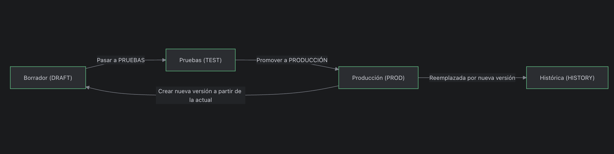
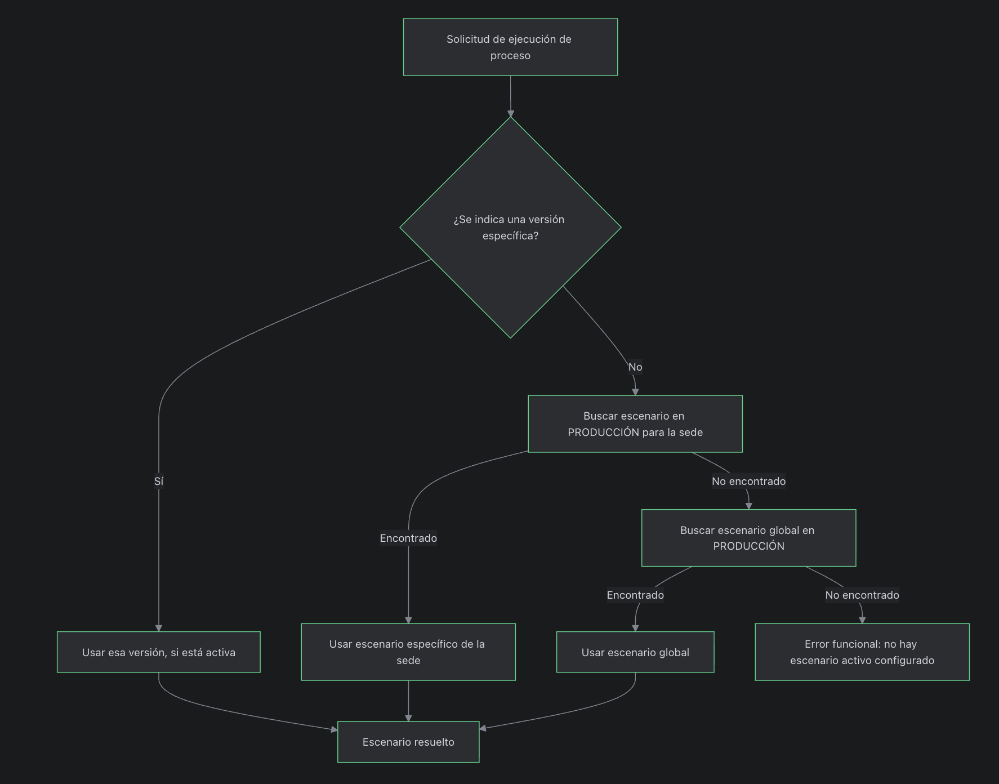

## Flujo funcional del gestor de ciclo de vida de procesos

Este documento describe, en lenguaje funcional, cómo se diseñan, prueban y ponen en producción los distintos escenarios de un proceso de negocio utilizando el gestor de ciclo de vida de procesos.

No se detallan tablas, migraciones ni elementos técnicos; el enfoque es 100% funcional.

---

## Conceptos clave (en lenguaje de negocio)

- **Tipo de proceso**  
  Es la “familia” del proceso. Ejemplos: “Apertura de cuenta”, “Alta de tarjeta”, “Reverso de operación”.

- **Escenario de proceso**  
  Es una versión concreta de cómo se ejecuta ese proceso: qué pasos tiene, en qué orden y con qué reglas.

- **Pasos del proceso**  
  Son las actividades que componen un escenario. Ejemplos: “Validar datos de entrada”, “Consultar scoring”, “Guardar resultado”, “Enviar notificación”.

- **Estados del escenario**
  - **Borrador (DRAFT):** la versión se está diseñando o ajustando. No se usa en producción.
  - **Pruebas (TEST):** la versión está lista para ser probada por negocio/QA.
  - **Producción (PROD):** la versión que se usa realmente en los procesos en vivo.
  - **Histórica (HISTORY):** versiones que ya fueron usadas en producción y que se conservan sólo como referencia.

- **Sede / contexto**  
  El mismo tipo de proceso puede tener distintos escenarios según la sede, país o unidad de negocio. También puede existir un escenario “global” que aplica cuando no hay uno específico para una sede.

---

## Flujo funcional: de la idea a producción

1. **Diseño de un nuevo escenario (Borrador)**
   - El equipo funcional define un nuevo escenario para un tipo de proceso.
   - Se agregan y ordenan los pasos que lo componen.
   - En este estado, el escenario puede cambiarse libremente.

2. **Pasar de Borrador a Pruebas**
   - Cuando negocio considera que el escenario está listo para ser probado, lo pasa de **Borrador** a **Pruebas**.
   - A partir de este momento, se espera que los cambios sean más controlados, ya que puede haber casos de prueba documentados.

3. **Validación en ambiente de prueba**
   - El equipo de QA/negocio ejecuta el escenario en entornos de prueba, revisando:
     - Que los pasos se ejecuten en el orden correcto.
     - Que las reglas de negocio se cumplan.
     - Que las salidas sean las esperadas.
   - Si se encuentran ajustes, se puede volver a una versión en Borrador (por ejemplo, replicando un escenario previo y revirtiendo el estado).

4. **Promoción a Producción**
   - Una vez que el escenario en Pruebas está aprobado, se promueve a **Producción**.
   - El sistema garantiza que, para cada combinación de tipo de proceso y sede, haya sólo un escenario activo en Producción.
   - Si ya existía un escenario en Producción para ese tipo de proceso y sede:
     - Ese escenario pasa a estado **Histórica**.
     - El nuevo escenario ocupa el lugar de **Producción**.

5. **Uso en tiempo real**
   - Cuando un sistema necesita ejecutar un proceso de negocio (por ejemplo, “Apertura de cuenta en la sede X”), el gestor:
     1. Verifica si se especificó explícitamente qué escenario usar (override).
     2. Si no hay override, busca el escenario en Producción para la sede solicitada.
     3. Si no existe para esa sede, busca el escenario global en Producción.
     4. Si tampoco existe global, devuelve un error funcional indicando que no hay un escenario activo configurado.
   - El sistema consumidor recibe:
     - El identificador del escenario que debe usar.
     - El listado de pasos, en el orden correcto, para ejecutar el flujo completo.

6. **Evolución del proceso (nuevas versiones)**
   - Cuando se quiere mejorar o cambiar un proceso que ya está en Producción:
     - Se toma un escenario existente (típicamente el actual en Producción) y se crea una copia como nuevo Borrador.
     - Se ajustan los pasos, reglas y configuraciones en ese Borrador.
     - Se sigue nuevamente el flujo:
       - Borrador → Pruebas → Producción.
   - De esta forma, la evolución del proceso es gradual y controlada.

7. **Historial y trazabilidad**
   - Cada vez que se promueve un escenario a Producción:
     - Se registra desde qué estado venía (por ejemplo, Pruebas o Histórica).
     - Se guarda quién realizó la acción (operador).
     - Se almacena el comentario que describe el motivo del cambio.
     - Se crea **un único** registro de historial asociado a la nueva versión en Producción (la versión anterior pasa a Histórica sin generar registro adicional).
   - La vigencia de cada versión en Producción puede inferirse:
     - `desde` = momento en que se promovió a Producción.
     - `hasta` = momento en que una nueva versión la reemplazó (siguiente promoción).
   - Esto permite responder preguntas como:
     - “¿Qué escenario estaba en Producción el día X?”
     - “¿Quién aprobó el cambio de este escenario?”
     - “¿Por qué se reemplazó este escenario?”

---

## Vista de alto nivel del ciclo de vida

El siguiente diagrama muestra, de forma simplificada, cómo se mueven los escenarios entre estados:

Lectura del diagrama:

- Un escenario nace en **Borrador**.
- Cuando está listo para ser probado, pasa a **Pruebas**.
- Tras la validación, se promueve a **Producción** (solo se permite desde **Pruebas** o **Histórica**).
- Cuando una nueva versión entra en Producción, la anterior pasa a **Histórica**.
- En cualquier momento se puede tomar la versión en Producción (u otra versión) como base para crear un nuevo Borrador.

---

## Vista funcional de resolución del escenario efectivo

El siguiente diagrama muestra cómo se decide qué escenario usar cuando un sistema solicita ejecutar un proceso:

En términos funcionales:

- Si se indica explícitamente qué escenario usar (por ejemplo, para pruebas controladas), se respeta esa elección siempre que la versión esté activa.
- Si no se indica nada:
  - Se prioriza un escenario específico para la sede solicitada.
  - Si no existe, se utiliza un escenario global.
  - Si tampoco hay escenario global, se devuelve un error claro indicando que falta configuración para ese proceso.

Este comportamiento garantiza que:

- Siempre que haya una configuración válida, se elige el mejor escenario disponible.
- Los errores por falta de configuración se detectan de forma explícita, en vez de usar comportamientos implícitos o ambiguos.
